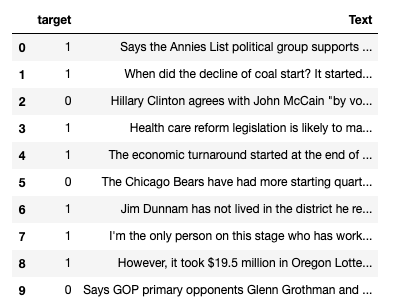

# Fake News Detection

## Introduction

Fake news, defined by the New York Times as “a made-up story with an intention to deceive”, often for a secondary gain, is arguably one of the most serious challenges facing the news industry today. In a December Pew Research poll, 64% of US adults said that “made-up news” has caused a “great deal of confusion” about the facts of current events.

The purpose of this project is to develop a model that can determine whether or not news content is fake.

## Data Source

The data came from a [Kaggle competition](https://www.kaggle.com/anmolkumar/fake-news-content-detection?select=train.csv).

The orginal dataset had 6 classes: Not Known, True, Mostly True, Half-True, Barely True, and False. The Not Known category was removed from the dataset due to it creating too much ambiguity. I also decided to reduce the number of classes by labeling the Trues and Mostly Trues as Not Fake (negative class) and the remaining categories as Fake (positive class).

 

 

Each observation contained a headline of a news article.

## Natural Language Processing

### Word2Vec
