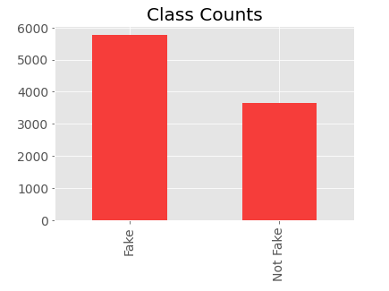

# Fake News Detection

## Introduction

Fake news, defined by the New York Times as “a made-up story with an intention to deceive”, often for a secondary gain, is arguably one of the most serious challenges facing the news industry today. In a December Pew Research poll, 64% of US adults said that “made-up news” has caused a “great deal of confusion” about the facts of current events.

The purpose of this project is to develop a model that can determine whether or not news content is fake.

## Data Source

The data came from a [Kaggle competition](https://www.kaggle.com/anmolkumar/fake-news-content-detection?select=train.csv). The orginal dataset had 6 classes: Not Known, True, Mostly True, Half-True, Barely True, and False. The Not Known category was removed from the dataset due to it creating too much ambiguity. I also decided to reduce the number of classes by labeling the Trues and Mostly Trues as Not Fake (negative class) and the remaining categories as Fake (positive class).

<br>



<br>

Each observation contained a headline of a news article.


## Natural Language Processing

The text was first cleaned by removing stopwords and punctuation. Lemmatization (nltk.wordnet.Lemmatizer) was used to reduce each word to its meaning in order to consolidate words. Two different approaches to processing the text and reducing the dimensions were taken: TF-IDF with PCA and Word Embedding.

### TF-IDF with PCA Pipeline

* `TfidfVectorizer` with max_features at 5,000
* PCA was run without setting n_components. I plotted the cumulative proportion of explained variance and found that I needed to keep 2,268 components in order to preserve 90% of the variance.


### Word Embedding Pipeline

Word embedding was performed using the `Word2Vec` class from `gensim.model`. The model creates a dictionary of word vectors. In order to create headline vectors, I averaged the vectors of each word in the headline. This was done using the below functions.

```python
def word_embed(bow_train, bow_test, min_count=2, size=100, seed=2):
    model = gensim.models.Word2Vec(bow_train, min_count = min_count, size = size, window = 5, seed=seed)

    vec_train = vectorize(bow_train, model, size)
    vec_test = vectorize(bow_test, model, size)
    return vec_train, vec_test

def vectorize(bow, model, size):
    corpus_vec = np.zeros((len(bow),size))
    for i, row in enumerate(bow):
        row_vec = np.zeros(size)
        for word in row:
            try:
                row_vec += model.wv[word]
            except:
                pass
        corpus_vec[i] = row_vec/len(row)
    return corpus_vec
```

I tried tuning the size by just running an un-tuned random forest model on the embedding data and didn't see any reliable pattern (this image was taken before I reduced the number of classes).


I began looking at cosine similarities of select headlines instead. I tried changing min_count to 2, but a few headline vectors were set to all zeros since there were too few "important" words in those headlines. To combat this, I added stopwords back in. With a vector size of 50 and a min_count of 2 (after stopwords were allowed back in), I got this result:


In the end, I decided to try out two different size options (50 and 1,000).

## Model Comparison

**Models**: Random Forest Classifier and XGBoost Classifier

**Metrics**: The models were tuned using ROC AUC; however, the models performed pretty evenly for that metric. Ultimately I looked at recall and precision to select my final model. 

The performance of each model is shown below. The Random Forest model using word embedding with a vector size of 1,000 performed the best.


## Next Steps
* Try a pre-tuned word embedding model
* Try Baysian Grid Search to tune the models
* See if a Neural Network performs better

## Appendix


